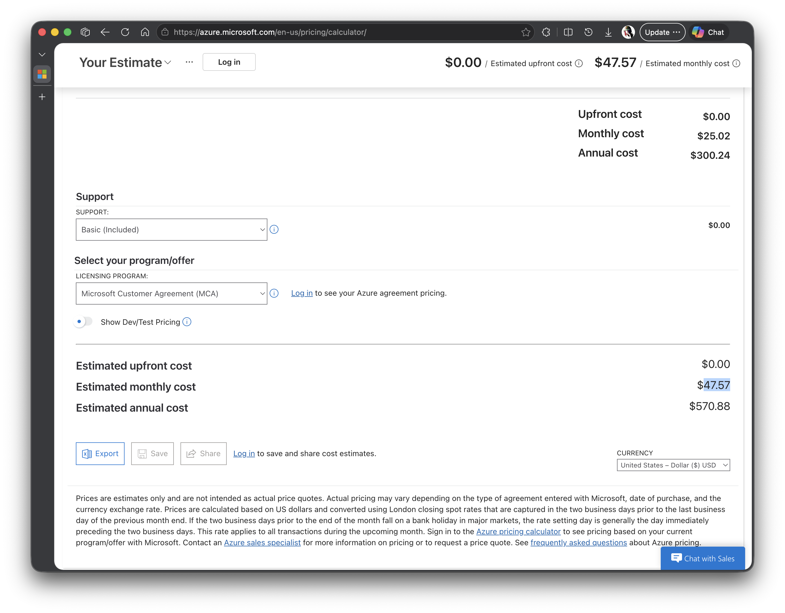

# ASCEND — Azure Cost Estimate Report

*Course:* CSEC 3 – Cloud Computing (Microsoft Azure)
*Term:* AY 2025–2026, 2nd Semester
*Team:* Renzzo & Jessica

---

## Architecture Summary

Ascend is a web-based Student Enrollment System deployed on
Microsoft Azure using the following resources:

- *Azure App Service (B1)* — Hosts the Flask web application
  that handles student enrollment submissions and admin review
- *Azure SQL Database (General Purpose)* — Stores all enrollment
  records, application statuses, and user accounts
- *Azure Blob Storage (LRS)* — Stores student-uploaded
  documents such as IDs and supporting files
- *Application Insights* — Monitors live application
  performance, errors, and request telemetry
- *GitHub Actions* — Automates deployment to Azure App
  Service on every push to the main branch

All resources are deployed in the *East Asia* region under
an *Azure for Students* subscription.

---

## Itemized Cost Breakdown

| Azure Resource | Tier | Monthly Cost |
|---|---|---|
| App Service | Basic B1 | $14.60 |
| Azure SQL Database | Gen Pur | $7.95 |
| Azure Blob Storage | LRS Standard | $25.02 |
| Application Insights | Free (5GB/month) | $0.00 |
| GitHub Actions | Free (2,000 min/month) | $0.00 |
| *Total* | | *$47.57/month* |

Estimates verified using the Azure Pricing Calculator:
https://azure.microsoft.com/en-us/pricing/calculator/

---

## Azure Pricing Calculator Screenshot

---

## Cost Optimization Notes

### 1. Use Free Tier App Service (F1) During Development
Downgrading from B1 to F1 reduces App Service cost from
$14.6 to $0.00/month during non-peak periods. The system
can be upgraded to B1 only during active enrollment seasons
when scaling is needed.

### 2. Azure SQL Auto-pause (Serverless)
The SQL Database automatically pauses during
periods of inactivity, reducing compute consumption to zero
when no students are submitting applications.

### 3. LRS over GRS Storage
Locally Redundant Storage was chosen over Geo-Redundant
Storage, reducing Blob Storage costs by 50% since
cross-region redundancy is not required for this project.

---

## Conclusion

By selecting free-tier services where possible and
right-sizing resources to actual workload requirements,
the Ascend system operates at approximately *$47.57/month*
— well within the $100 Azure for Students credit limit.
azure.microsoft.com